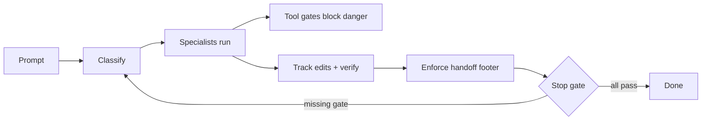

# agnthive

Install — not in the plugin directory yet, so install from source in one command:

```bash
git clone https://github.com/C0FFEEC0DE/agnthive.git && cd agnthive && claude plugin install ./plugins/agnthive
```

[](https://github.com/C0FFEEC0DE/agnthive/actions/workflows/validate.yml)
[](https://github.com/C0FFEEC0DE/agnthive/actions/workflows/hooks-test.yml)
[](https://github.com/C0FFEEC0DE/agnthive/actions/workflows/security-scan.yml)

Claude Code with a software engineering discipline built in — a **hook-gated SDLC
profile** wraps every prompt in discover → design → implement → verify → review →
docs, eight specialist agents collaborate with guardrails on, and a benchmark
suite catches regressions before they ship.

## How it works



Full diagram and the pieces: [`plugins/agnthive/references/architecture.md`](plugins/agnthive/references/architecture.md).

## Agents

| Alias | Role | Purpose |
|-------|------|---------|
| `@m` | Manager | Orchestrates other agents |
| `@cr` | Code Reviewer | Code review + security |
| `@t` | Tester | Verification + regression |
| `@e` | Explorer | Codebase exploration |
| `@a` | Architect | System design |
| `@bug` | Bugbuster | Bug hunting |
| `@dbg` | Debugger | Debugging issues |
| `@doc` | Docwriter | Documentation |

Full names work too: `@code-reviewer`, `@tester`, etc.

## Usage

```
@e explore the auth module
@cr review api.mjs
@t write tests for utils
@manager implement new feature: user authentication
```

### Slash commands

- `/manager` — manager-led orchestration
- `/explore` — codebase exploration
- `/bug` — bug hunting
- `/debug` — debugging
- `/test` — testing
- `/design` — design
- `/refactor` — refactoring
- `/review` — code review
- `/docs` — documentation

These are the documented entry points; the hooks enforce the actual handoff and stop gates. When a benchmark needs a visible role-usage marker, it may also require an explicit `Handoff evidence: @alias ...` line in the transcript.

### Required handoffs

| Type | Required |
|------|----------|
| feature | verification or `@t` + `@cr` + (`@e` or `@a`) |
| bugfix | verification or `@t` + `@cr` + (`@bug` / `@e` / `@dbg`) |
| refactor | verification or `@t` + `@cr` + (`@a` or `@e`) |
| review | `@cr` |
| docs | `@doc` |

## Install

agnthive isn't in the Claude Code plugin directory yet, so install from source:
clone this repo, then from the checkout run:

```bash
claude plugin install ./plugins/agnthive
```

Restart Claude Code. See `plugins/agnthive/README.md` for requirements,
configuration, the optional status line, and legacy-migration notes (if you
previously installed the old `~/.claude` profile via `./install.sh`).

## Configuration

All configuration is **environment variables and the plugin-scoped `userConfig`**. The plugin never reads or writes `~/.claude/settings.json`, so installation is non-destructive.

- **Command policy mode:** `userConfig.enforcement_mode` (default `advisory`) or the `AGNTHIVE_POLICY` env var (`advisory` fail-open vs `enforce` fail-closed on unparseable indirection). The legacy `CLAUDE_CREW_POLICY` alias is still honored.
- **Log rotation / ledger size:** `AGNTHIVE_LOG_MAX_BYTES` (1 MiB default) and `AGNTHIVE_LEDGER_MAX_BYTES` (64 KiB default), with `CLAUDE_CREW_*` legacy aliases.
- **Progress ledger:** `AGNTHIVE_PROGRESS_FILE` overrides the location; default `<projectDir>/.agnthive/progress.md` (gitignored).
- **Observability:** `Notification` and other runtime hook events write structured JSONL streams under `${CLAUDE_PLUGIN_DATA}/logs` (rotated at `AGNTHIVE_LOG_MAX_BYTES`), not `~/.claude/logs/`.
- See [`plugins/agnthive/README.md`](plugins/agnthive/README.md) for the full knob table and [`plugins/agnthive/references/token-cost.md`](plugins/agnthive/references/token-cost.md) for the spend story.

## Docs

- [`plugins/agnthive/README.md`](plugins/agnthive/README.md) — plugin cheatsheet
- [`plugins/agnthive/references/architecture.md`](plugins/agnthive/references/architecture.md) — how the hooks fit together
- [`plugins/agnthive/references/token-cost.md`](plugins/agnthive/references/token-cost.md) — minimal token spend
- [`docs/benchmarking.md`](docs/benchmarking.md) — benchmark setup, including `make bench-precheck` to reproduce the smoke precheck locally without a model
- [`plugins/agnthive/references/agent-contracts.md`](plugins/agnthive/references/agent-contracts.md) — agent contracts
- [`docs/website.md`](docs/website.md) — hosting the project site at <https://agnthive.run> via GitHub Pages (DNS records + setup)

## Contributing

See [`CONTRIBUTING.md`](CONTRIBUTING.md). Run `make lint`, `make test`, `node scripts/validate.mjs` before a PR. Report security issues via [`SECURITY.md`](SECURITY.md).

## License

MIT — see [`LICENSE`](LICENSE).
